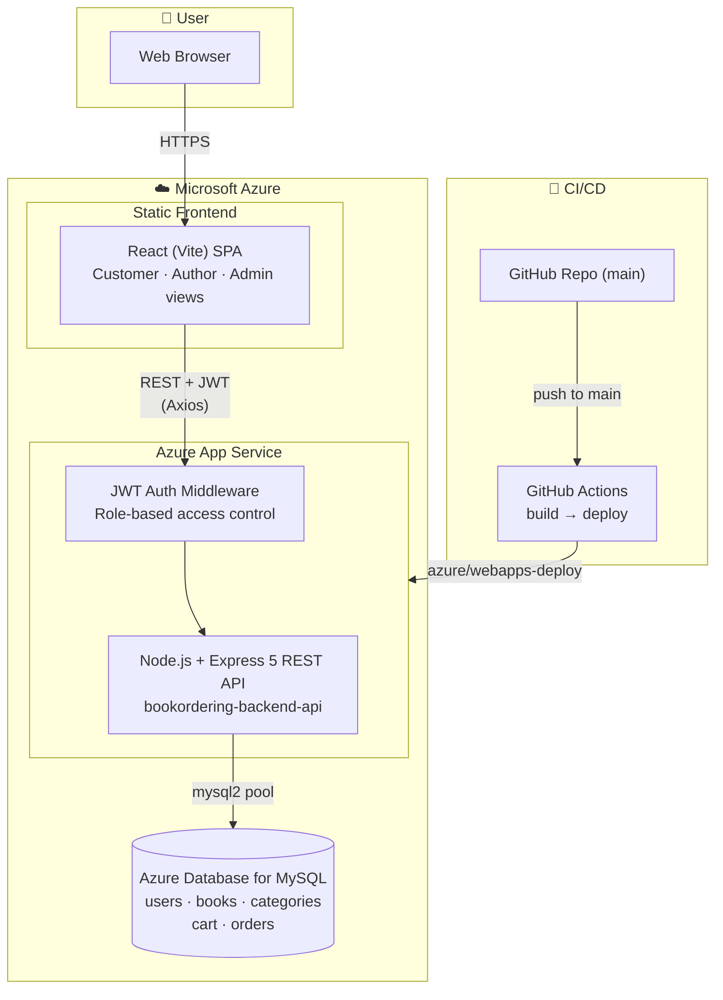

# 📚 Book Ordering System

A full-stack, **cloud-deployed** web application for browsing, managing, and ordering books online. Customers can browse a catalog, add books to a cart or wishlist, and place orders; authors can manage their own titles; and admins oversee the whole platform. Built with a **React (Vite)** frontend and an **Express + MySQL** REST API, secured with JWT-based authentication and role-based access control, and **deployed to Microsoft Azure** via a GitHub Actions CI/CD pipeline.


---

## 🏗️ Architecture

The application follows a classic three-tier architecture — a React SPA client, a stateless Express REST API, and a MySQL database — deployed on Azure with automated builds and releases from GitHub.



### Deployment Flow
1. A push to the `main` branch triggers the **GitHub Actions** workflow (`.github/workflows/main_bookordering-backend-api.yml`).
2. The workflow installs dependencies and packages the `server/` app on a Node.js 22 runner.
3. It authenticates to Azure via OIDC (federated credentials — no stored publish profile) and deploys to the **Azure App Service** `bookordering-backend-api`.
4. The API connects to **Azure Database for MySQL** using connection settings supplied through App Service configuration / environment variables.

---

## ✨ Features

- **Authentication & Authorization** — Register/login with hashed passwords (bcrypt) and JWT tokens.
- **Role-based access** — Three roles: `customer`, `author`, and `admin`, each with protected routes.
- **Book catalog** — Browse books, view details, and search by title/category.
- **Categories** — Books organized into browsable categories.
- **Shopping cart** — Add, update, and remove items before checkout.
- **Wishlist** — Save books for later.
- **Orders** — Place orders and view order history.
- **Admin & Author dashboards** — Manage books and platform content.

---

## 🛠️ Tech Stack

### Frontend (`client/`)
- [React 19](https://react.dev/) + [Vite](https://vitejs.dev/)
- [React Router](https://reactrouter.com/) for routing
- [Tailwind CSS](https://tailwindcss.com/) for styling
- [Axios](https://axios-http.com/) for API calls

### Backend (`server/`)
- [Node.js](https://nodejs.org/) + [Express 5](https://expressjs.com/)
- [MySQL](https://www.mysql.com/) (via `mysql2`)
- [JWT](https://jwt.io/) (`jsonwebtoken`) for auth
- [bcryptjs](https://www.npmjs.com/package/bcryptjs) for password hashing
- [dotenv](https://www.npmjs.com/package/dotenv), [cors](https://www.npmjs.com/package/cors)

### Cloud & DevOps
- **Microsoft Azure** — App Service (backend API), Azure Database for MySQL
- **GitHub Actions** — automated CI/CD build & deploy pipeline
- Azure login via **OIDC federated credentials** (see the [Architecture](#️-architecture) section)

---

## 📁 Project Structure

```
BookOrderingSystem/
├── client/                 # React + Vite frontend
│   └── src/
│       ├── api/            # Axios instance
│       ├── components/     # Reusable UI components
│       ├── context/        # Auth context
│       └── pages/          # Route pages (Home, Login, Books, Cart, ...)
├── server/                 # Express + MySQL backend
│   ├── config/             # DB connection pool
│   ├── controllers/        # Route handlers (auth, book, cart, order, category)
│   ├── middleware/         # JWT auth middleware
│   ├── models/             # SQL data-access layer
│   └── routes/             # API route definitions
└── .github/workflows/      # CI/CD (Azure deployment)
```

---

## 🚀 Getting Started

### Prerequisites
- [Node.js](https://nodejs.org/) (v18+)
- [MySQL](https://www.mysql.com/) server

### 1. Clone the repository
```bash
git clone <your-repo-url>
cd BookOrderingSystem
```

### 2. Backend setup
```bash
cd server
npm install
```

Create a `.env` file in `server/` with:
```env
PORT=5000
DB_HOST=localhost
DB_USER=your_mysql_user
DB_PASSWORD=your_mysql_password
DB_NAME=book_ordering
JWT_SECRET=your_secret_key
```

Start the API:
```bash
npm run dev      # development (nodemon)
# or
npm start        # production
```
The API runs at `http://localhost:5000`.

### 3. Frontend setup
```bash
cd client
npm install
npm run dev
```
The app runs at `http://localhost:5173`.

---

## 📄 License

This project is for educational purposes.
